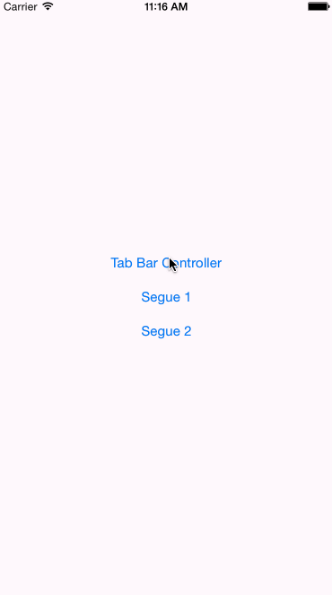
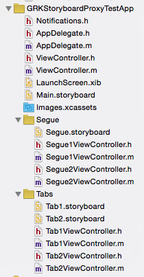
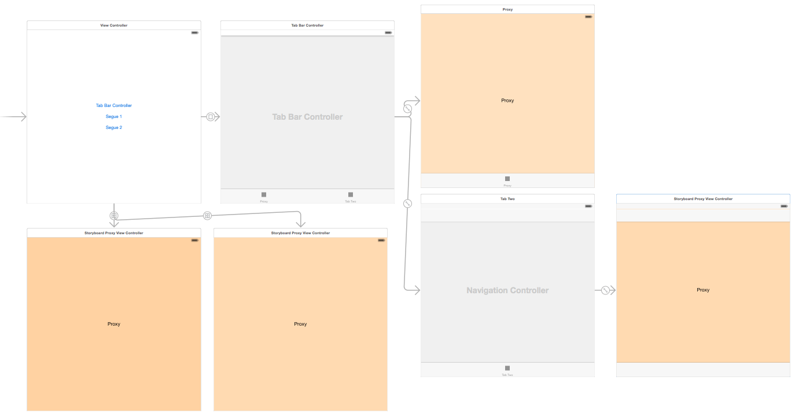

GRKStoryboardProxy
===========
A UIViewController subclass which can be used as a proxy for another view controller which
resides in a separate Storyboard. At runtime, the proxy view controller will be replaced
appropriately.

When working in Interface Builder with Storyboards, often the Storyboard will become quite
large as more and more view controllers are added. In many circumstances this causes
performance issues in Xcode, navigation issues for the developer, and merge conflicts when
working on the same project in a team.

This project aims to address this situation by allowing the developers to link to separate
Storyboards via a proxy view controller, and at runtime have those proxies replaced with
the desired target view controllers.

In this demo application, `GRKStoryboardProxyViewController` is used to break the
application into multiple Storyboard files at various boundaries. One storyboard for each
tab of a UITabBarController. One storyboard for two different view controllers, each
presented via a segue from the main interface:

### Installing

If you're using [CocoPods](http://cocopods.org) it's as simple as adding this to your
`Podfile`:

	pod 'GRKStoryboardProxy'

otherwise, simply add the contents of the `GRKStoryboardProxy` subdirectory to your
project.

### Documentation

To use, create a UIViewController in your parent Storyboard, set the class to
`GRKStoryboardProxyViewController`, configure the proxy to point at your desired target
Storyboard and view controller, and then connect it to the rest of your app as if it were
the target view controller.

NOTE: At runtime the proxy will be entirely replaced by the view controller you have
specified. This is important to understand since any changes made to the proxy will not
apply to the final view controller. Those changes will need to be made on the actual view
controller in its own Storyboard.

Configuration of the proxy is done by using the `restorationIdentifier` property of the
view controller. 

This configuration metadata is expected to be located in the Restoration Identifier for this proxy
instance and in the following format:

    [<sceneIdentifier>@]<storyboardName>[#<storyboardBundleIdentifier>]

where:

* `sceneIdentifier` is the optional identifier of the target scene in the storyboard represented by `storyboardName`.
 If not supplied we will use the initial view controller of the storyboard.
* `storyboardName` is the file name of the external storyboard (minus the `.storyboard` suffix).
* `storyboardBundleIdentifier` is the optional bundle identifier in which to locate the specified storyboard.
   If not supplied we will assume the storyboard is located in the main bundle.
   
e.g.: You could specify "GRKMyFancyViewController" as the metadata in Interface Builder's Restoration Identifier
for this proxy instance, and we would attempt to load the initial view controller from a storyboard file named
"GRKMyFancyViewController.storyboard" in the main bundle.

Additional documentation is available in `GRKStoryboardProxyViewController.h` and example usage
can be found in the `GRKStoryboardProxyViewControllerTestApp`.

#### Disclaimer and Licence

* While investigating the technology needed to implement this, I found a gist by
  [@advantis](https://github.com/advantis)
  [https://gist.github.com/advantis/6986967](https://gist.github.com/advantis/6986967)
  which helped resolve an issue with returning a view controller loaded from an alternate
  storyboard from `awakeAfterUsingCoder:`. His approach and mine are nearly identical, and
  his work precedes mine.
* This work is licensed under the [Creative Commons Attribution 3.0 Unported License](http://creativecommons.org/licenses/by/3.0/).
  Please see the included LICENSE.txt for complete details.

#### About
A professional iOS engineer by day, my name is Levi Brown. Authoring a blog
[grokin.gs](http://grokin.gs), I am reachable via:

Twitter [@levigroker](https://twitter.com/levigroker)  
App.net [@levigroker](https://alpha.app.net/levigroker)  
Email [levigroker@gmail.com](mailto:levigroker@gmail.com)  

Your constructive comments and feedback are always welcome.
